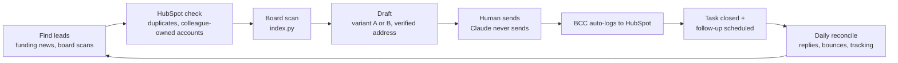

# Tribe Claude Skills

The playbook that runs Tribe's outbound sales desk inside Claude. Two skills, built and battle-tested on live outreach in August 2026: one writes, one keeps the discipline. Together they turn "find me leads" into sent-ready drafts with the CRM already handled.

**This repository is PRIVATE.** It contains the full outbound playbook, client proof points, live A/B test variants and HubSpot record references. Never fork it public.

## What the system guarantees

Every send logged in HubSpot automatically. Every follow-up scheduled the moment a send is confirmed, so no account ever goes quiet unnoticed. Every email built on live job board data from the Tribe Board Index, a weekly scan of 41 European scaleup boards that no competitor can quote. And every design choice tested, not argued: the two email variants run as a live A/B test with replies as the metric.

## The two skills

### tribe-outbound-sequence, the writing half

Turns a prospect name into a sent-ready draft: checks HubSpot for duplicates and colleagues already on the account, scans the prospect's live job board, writes the email in Jacopo's voice using one of two locked A/B variants, enriches the recipient's verified email address, and creates the dated HubSpot task that carries the whole plan.

Its engine is `index.py`, the Tribe Board Index scanner. Run it before any batch: it pulls 41 scaleup job boards through the Ashby API and computes the numbers the emails quote ("your role is at 127 days, the market median is 33"). Nobody else in the market can send that sentence.

Source: `tribe-outbound-sequence.SKILL.md` | Packaged: `tribe-outbound-sequence.skill`

### tribe-sales-desk, the discipline half

The 15-minute daily run that keeps the pipeline honest: reconciles the task list against what was actually sent (never trusts the plan), catches replies with no task behind them, checks bounces and email-tracking health, and enforces the follow-up ladder, first touch, second touch 2 to 3 weeks later, then route to a second name or park. Closing a task and scheduling its successor happen in the same motion, so no account ever goes silent unnoticed.

Source: `tribe-sales-desk.SKILL.md` | Packaged: `tribe-sales-desk.skill`

## How the pieces fit

The human stays in the loop at exactly one point: the send. Claude drafts, logs, schedules and audits; a person reads and presses Send.

## Getting started

Read **[USAGE.md](USAGE.md)**. It has the setup checklist (which connectors to link), the exact phrases to say to Claude, and a walkthrough of a full day on the desk.

## Installing the skills

Individual: claude.ai → Customize → Skills → upload a `.skill` file from this repo.

Org-wide (org owner only, Team/Enterprise plan): Organization settings → Skills → enable the Skills toggles → Add → upload the `.skill` file. Everyone at Tribe gets it, and re-uploading updates it for all.

## Updating

Edit the `.SKILL.md` source (or `index.py`). To repackage: create a folder named after the skill containing `SKILL.md` (plus `scripts/index.py` for the outbound skill), zip it, rename the zip `<skill-name>.skill`, replace it here, re-upload to claude.ai. The skills carry their change history as dated decisions inside the prose; keep that convention, future Claude sessions rely on it.

## Before teammates run these

Both skills are currently personalized to Jacopo (signature, Calendly link, first-person voice, A/B test ownership). A teammate running them as-is would draft emails signed Jacopo. The team edition, with sender identity as a slot, is the next step; until then, treat this repo as the reference playbook and ask Jacopo before adopting.
