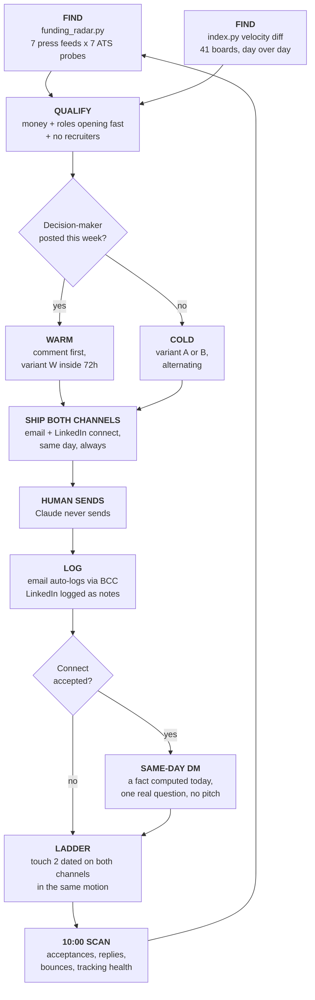

# Tribe Claude Skills

**The outbound sales desk, running inside Claude.** Two skills do the work: one finds and writes, one keeps the discipline. Together they turn "find me leads" into sent-ready drafts with the CRM already handled and every follow-up already dated.

Built and hardened on live outreach through August 2026. Every rule in here exists because something went wrong once and cost something.

> **This repo is public so the team can use it without access friction.** It carries the full playbook, client proof points, live A/B variants and CRM references, so don't advertise the link outside Tribe.

---

## The idea in one paragraph

Most outbound fails because it guesses. This one doesn't: every email quotes a number computed that same week from the prospect's own job board, measured against 41 European scaleup boards. "Your Account Executive has been open 146 days. The market median is 32." That sentence is unarguable, it is about them, and no competitor can send it.

---

## How a lead travels



**The rule that makes it work:** closing a task and scheduling its successor happen in the same motion. A closed task without a successor is the failure this system exists to prevent.

---

## The two skills

| | **tribe-outbound-sequence** | **tribe-sales-desk** |
|---|---|---|
| **Does** | Finds leads, writes the outreach | Keeps the pipeline honest |
| **Run it when** | "run the lead engine", "prep the outbound" | "prep my day", "what's due", "someone replied" |
| **Owns** | Lead Engine, the A/B variants, proof rules, address verification | Daily reconcile, follow-up ladder, CRM hygiene, weekly sweep |
| **Source** | `tribe-outbound-sequence.SKILL.md` | `tribe-sales-desk.SKILL.md` |
| **Packaged** | `tribe-outbound-sequence.skill` | `tribe-sales-desk.skill` |

Use the desk skill **first**. It decides what deserves the effort before anything gets written.

---

## The scripts

### `funding_radar.py`, the free lead finder

```bash
python3 funding_radar.py --days 3     # daily
python3 funding_radar.py --days 7     # Monday harvest
```

Sweeps 7 European funding-press RSS feeds, extracts every company that raised, then probes 7 ATS providers (Ashby, Lever, Greenhouse, Workable, Recruitee, SmartRecruiters, Personio) for each one's live board. Scores what it finds: total roles, roles posted in the last 14 days, recruiter count.

**Money + a board opening roles fast + no recruiters = the lead.** Zero credits, no paid data.

### `index_post.py`, the weekly benchmark

```bash
python3 index_post.py            # this week's LinkedIn post
python3 index_post.py --raw      # plus the numbers as JSON
```

Turns the same scan into a paste-ready public benchmark: role count, medians by function with week-over-week movement, the >90 and >300 day counts. **This is the compounding half of the system.** Outbound is linear, one email to one prospect. A published index gets read by founders who would delete a cold email, and it is the only part nobody can copy without building the scanner first.

Anyone who comments is an inbound lead, and the reply is the outreach.

### `index.py`, the Tribe Board Index

```bash
python3 index.py                 # market stats
python3 index.py monumental      # one company's full board
python3 index.py --probe 146     # percentile for a 146-day-old role
```

Scans 41 European scaleup boards and computes the numbers every email quotes: medians by category, percentile tables, the >90/>180/>300 day counts, open recruiter roles, and TA pressure per board. It also **diffs against the previous run**, which is how a company gets spotted the week it starts scaling rather than the month after.

---

## What the system guarantees

**Nothing gets sent by Claude.** Every email is a draft until a human presses send. Every address is verified before it touches a To field.

**Every lead gets two channels.** Email and LinkedIn connect ship together, same day, every time. A prep with only an email is incomplete.

**Every acceptance gets answered the same day.** A scanner runs at 10:00 on weekdays, finds who accepted, re-scans their board for something true that was not in the email, and hands over a written message. Through 24 August: 4 acceptances from 10 double-channel sends, against 0 replies from roughly 35 emails sent alone.

**Nothing goes quiet unnoticed.** Every send, on either channel, gets a dated follow-up created the moment the send is confirmed.

**Every number is fresh.** No email quotes a figure that wasn't computed that week from a live board.

**Design choices get tested honestly.** The A/B test measures one variable at a time on opens, not whole emails on replies, because at this volume the second design can never conclude anything.

---

## The supporting skills

**`linkedin-engagement-radar`** feeds the warm lane: it checks decision-makers at freshly harvested companies for recent posts, so a comment can land before the outreach does. Its second mode does maintenance commenting on the account list, on explicit ask only.

**`jacopo-linkedin-voice`** and **`tribe-brand`** govern how anything published or sent actually sounds, personal voice and company brand respectively.

**`anti-ai-writing-skill`** is the quality gate on every piece of prose. It bans the vocabulary, sentence shapes and hype patterns that make writing read as machine-generated. Every cold email passes through it.

---

## Getting started

1. Read **[USAGE.md](USAGE.md)**, the operator's manual: which connectors to link, the exact phrases to say, and a walkthrough of a full day.
2. Install a skill: claude.ai → Customize → Skills → upload a `.skill` file from this repo.
3. Org-wide (owner only, Team/Enterprise): Organization settings → Skills → Add → upload. Re-uploading updates it for everyone.

Improving these is a team sport. **[CONTRIBUTING.md](CONTRIBUTING.md)** covers how to propose changes without breaking the machine.

---

## Before you run these as yourself

Both skills are currently personalised to Jacopo: signature, Calendly link, first-person voice, A/B test ownership. Run them as-is and you'll draft emails signed Jacopo. The team edition, with sender identity as a slot, is the next piece of work. Until then treat this as the reference playbook and ask before adopting.
